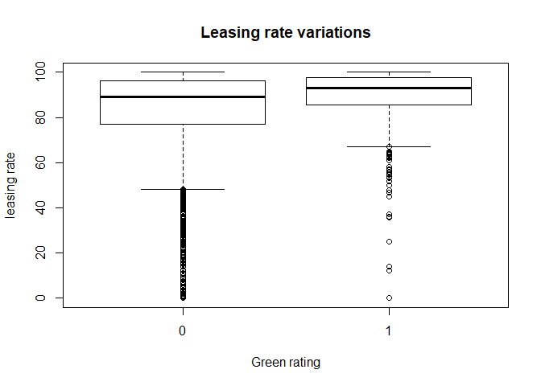

Pedictive Modeling - 10Aug
================

### Probability Practice - Part A

Probability of the person being a random clicker,  = 0.3")
Probability of the person being a truthful clicker,  = 0.7")
Using survery results,  = 0.65") and  = 0.35")
For random clickers,  = 0.5")

Applying rule of total probability,
 = p(Yes|TC)*p(TC) + p(Yes|RC)*p(RC)")

All values except P(Yes|TC) are known in the above equation. Plugging in we get,
*0.7 + 0.5*0.3")

Solving gives  =") 0.7142857

### Probability Practice - Part B

Probability to test positive given someone has disease,  = 0.993")
Probability to test negative given someone is healthy,  = 0.9999")
Probability that someone has a disease,  = 0.000025")

To find: Probability of having disease given the test is positive, i.e. ")

 = \frac{p(P.D)}{p(P)}")
*p(D)}{p(P|D)*p(D) + p(P|H)*p(H)}")

Here,  = 1 - p(N|H)")
 = 1 - p(D)")

Substituting all values give  =") 0.1988824

This number is very low if it is planned to implement this testing policy for the disease. Only ~20% of the individuals identified positive actually have the disease.

Exploratory analysis: green buildings
-------------------------------------

First, we will analyze the recommendation from the hired person.

1.  Low occupancy buildings were scrapped from the analysis, but even they could contain some meaningful information about the rents in green and non-green buildings. We see from the following plot that very low leasing rates are found majorly in non-green buildings and we are scrapping this information away by removing such rows.



Other methods should be used in an attempt to clean the data and remove outliers. Exploring the variation in size and stories of buildings, we have the following results:

1.  More than 25% of the buildings are covered within size range of 100,000 sq. ft. to 300,000 sq. ft. and from the recommendation we note that size of this new building is 250,000 sq. ft. Hence, for the analysis going forward, it is appropriate to concentrate the analysis for buildings in this size range.

        ##    Min. 1st Qu.  Median    Mean 3rd Qu.    Max. 
        ##    1624   50891  128838  234638  294212 3781045

2.  The builder has a 15 storey building, so lets narrow down our dataset basis storey sizes. Looking at the variations in number of storeys in the dataset -

        ##    Min. 1st Qu.  Median    Mean 3rd Qu.    Max. 
        ##    1.00    4.00   10.00   13.58   19.00  110.00

    More than 50% of the buildings are covered within 4 to 30 storeys.

So, applying these filters basis building size and number of storeys on the original dataset with 7894 rows, we reduce our dataset to 3260 rows.

1.  Now lets look at the rent distribution in green vs non-green buildings.

    

    Rent distribution for green buildings:

        ##    Min. 1st Qu.  Median    Mean 3rd Qu.    Max. 
        ##    8.87   22.00   28.65   31.06   36.88  138.07

    Rent distribution for non-green buildings:

        ##    Min. 1st Qu.  Median    Mean 3rd Qu.    Max. 
        ##    2.98   20.00   26.69   29.50   36.64  175.00

So, the median values for green buildings is now 28.65 and for non-green buildings it is 26.69.

If we go back to the problem, we started with only 685 green buildings out of the total 1360. Since the medians calculated above are not on the whole population, we will implement bootstrapping methods to determine our confidence in stated values.

95% confidence interval for median of Rents of green building is:

    ##     name lower upper level     method estimate
    ## 1 result  27.5 31.22  0.95 percentile    28.65

and the same for non-green buildings is:

    ##     name lower upper level     method estimate
    ## 1 result 25.72    27  0.95 percentile    26.69

The maximum possible difference in rents thus comes out to be  =") 5.5 and  =") 0.5 as the minimum.

1.  Before starting the cost benefit analysis, let us check for any confounding variables. This is done because we have found correlation between rent and green buildings uptil now, but have no proof of the causation. Since the clusters take care of controlled sampling, we look for variables which can vary even within a cluster and can impact rents of green vs non-green buildings. Two of such variables are age and class.

    

    It is observed that all green buildings are very new and this can be the cause of high median price of green buildings. Upon checking for the correlation between age and rent, the vaue comes out to be -0.1466975.
    On checking the same metric of rent with class\_a, result obtained is 0.2216201. The distribution is as follows:

        ##        green_rating
        ## class_a    0    1
        ##       0 1415   49
        ##       1 1446  350

So, it is possible that higher rent seen for green buildings actually come out of the fact that they are new and belong to class\_a. Let us fit two logistic regressions and check for important variables to verify the same.

``` r
mod1 = glm(Rent ~ age+class_a+green_rating, data = filtered_gb)
summary(mod1)
```

    ## 
    ## Call:
    ## glm(formula = Rent ~ age + class_a + green_rating, data = filtered_gb)
    ## 
    ## Deviance Residuals: 
    ##     Min       1Q   Median       3Q      Max  
    ## -23.902   -9.106   -2.601    6.923  148.842  
    ## 
    ## Coefficients:
    ##               Estimate Std. Error t value Pr(>|t|)    
    ## (Intercept)  27.293516   0.683428  39.936   <2e-16 ***
    ## age          -0.014194   0.009579  -1.482    0.138    
    ## class_a       5.638467   0.570429   9.885   <2e-16 ***
    ## green_rating -0.841145   0.728246  -1.155    0.248    
    ## ---
    ## Signif. codes:  0 '***' 0.001 '**' 0.01 '*' 0.05 '.' 0.1 ' ' 1
    ## 
    ## (Dispersion parameter for gaussian family taken to be 171.8896)
    ## 
    ##     Null deviance: 589151  on 3259  degrees of freedom
    ## Residual deviance: 559673  on 3256  degrees of freedom
    ## AIC: 26036
    ## 
    ## Number of Fisher Scoring iterations: 2

It can be seen that green\_rating is not a significant variable and variation in rent is highly dependent on class. AIC of this model come out to be 26036 Let us compare this AIC with another model without using green\_rating.

``` r
mod2 = glm(Rent ~ class_a+age, data = filtered_gb)
summary(mod2)
```

    ## 
    ## Call:
    ## glm(formula = Rent ~ class_a + age, data = filtered_gb)
    ## 
    ## Deviance Residuals: 
    ##     Min       1Q   Median       3Q      Max  
    ## -23.829   -9.122   -2.550    6.882  148.845  
    ## 
    ## Coefficients:
    ##              Estimate Std. Error t value Pr(>|t|)    
    ## (Intercept) 27.181333   0.676525  40.178   <2e-16 ***
    ## class_a      5.549683   0.565255   9.818   <2e-16 ***
    ## age         -0.012825   0.009505  -1.349    0.177    
    ## ---
    ## Signif. codes:  0 '***' 0.001 '**' 0.01 '*' 0.05 '.' 0.1 ' ' 1
    ## 
    ## (Dispersion parameter for gaussian family taken to be 171.9073)
    ## 
    ##     Null deviance: 589151  on 3259  degrees of freedom
    ## Residual deviance: 559902  on 3257  degrees of freedom
    ## AIC: 26036
    ## 
    ## Number of Fisher Scoring iterations: 2

The AIC remians almost the same. Hence, it can be stated that green\_rating is not a good predictor for rents of buildings. Variation seen by the hired person was actually because of the class of the buildings and age.

1.  Going further, looking at the variation in rents within green buildings,


The difference in median values is not significant. Though the spread of LEED certified buildings tend to be on the higher side.

1.  Ways to improve the study:
    Since the location of building is known, the buildier will also know the cluster to which the property belongs. So analysis of rents within clusters of interest can be done to get better insights. Average rents show a remarkable variance within clusters:


Bootstrapping: ETFs
-------------------

We start with loading data for SPY, TLT, LQD, EEM, VNQ starting 2005 and adjust for the split and dividends. We get a matrix with close to close changes combined for these.

Our matrix looks like this:

    ##               ClCl.SPYa     ClCl.TLTa     ClCl.LQDa     ClCl.EEMa
    ## 2005-01-04 -0.012219459 -0.0104800543 -0.0056124454 -0.0307885599
    ## 2005-01-05 -0.006900614  0.0053524771  0.0008062713 -0.0122416742
    ## 2005-01-06  0.005084306  0.0006796217  0.0007161579 -0.0006797887
    ## 2005-01-07 -0.001433260  0.0022640368 -0.0004472940  0.0019361538
    ## 2005-01-10  0.004728115  0.0015811949 -0.0017003312  0.0012534287
    ## 2005-01-11 -0.006890756  0.0058637461  0.0023307485 -0.0018778833
    ##               ClCl.VNQa
    ## 2005-01-04 -0.015029523
    ## 2005-01-05 -0.033242471
    ## 2005-01-06  0.007703871
    ## 2005-01-07 -0.002237610
    ## 2005-01-10 -0.003176939
    ## 2005-01-11 -0.010123753

To get an idea of the correlation, we plot pairs for all five:  All the ETFs look quite correlated with some outliers in EEMa and LQD being very stable.

Lets also look at their individual fluctuations to understand the volatility of each. 

There is a huge fluctualtion around 1000th observation for all the ETFs. These rows correspond to days in the year 2008 - the time of economic crisis when the stock market went haywire.
In an attempt to quantify this fluctualtions, lets look at the correlation matrix and standard deviations of each of these ETFs. Standard deviations are calculated from rows starting 1100 to eliminate the impact of 2008 uncertainty in current predictions.

Correlation matrix:

    ##            ClCl.SPYa  ClCl.TLTa  ClCl.LQDa   ClCl.EEMa   ClCl.VNQa
    ## ClCl.SPYa  1.0000000 -0.4135842 0.10201265  0.31209933  0.76183118
    ## ClCl.TLTa -0.4135842  1.0000000 0.45248143 -0.12033619 -0.23566750
    ## ClCl.LQDa  0.1020126  0.4524814 1.00000000  0.06008424  0.07577252
    ## ClCl.EEMa  0.3120993 -0.1203362 0.06008424  1.00000000  0.21899233
    ## ClCl.VNQa  0.7618312 -0.2356675 0.07577252  0.21899233  1.00000000

Standard Deviations:
(a) SPY: 0.0117556
(b) TLT: 0.0086969
(c) LQD: 0.0049332
(d) EEM: 0.050991
(e) VNQ: 0.0198774

These numbers suggest that EEM is the most aggressive of all ETFs and LQD the safest.

### Portfolio Management

#### Scenario A: The even split

We will start with initial wealth of 100,000 and take bootstrap samples from data of years 2005 till today to approximate the returns of next 20 days. Wealth after 20 days is thus calculated. This whole process is repeated 5000 times to get a monte carlo distribution of wealth after 20 days.

``` r
set.seed(100)
initial_wealth = 100000
sim1 = foreach(i=1:5000, .combine='rbind') %do% {    #Monte-carlo
  total_wealth = initial_wealth
  weights = c(0.2, 0.2, 0.2, 0.2, 0.2)               #Equal splits
  n_days = 20
  wealthtracker = rep(0, n_days)                     #tracking wealth of 20 days for each simulation
  for(today in 1:n_days) {                           #Bootstrap
    return.today = resample(all_returns, 1, orig.ids=FALSE)   #taking a bootstrap sample
    holdings = weights * total_wealth                #redistributing wealth among the ETFs before the start of day
    holdings = holdings + holdings*return.today      #holdings in each ETF at end of the day
    total_wealth = sum(holdings)                     #total wealth at end of the day
    wealthtracker[today] = total_wealth              #populating the wealthtracker
  }
  wealthtracker                                      #adding a row to 'sim1' for i th monte carlo simulation
}
```

Looking at the distribution of losses at the end of 20 days as a result of 5000 simulations:

``` r
hist(initial_wealth - sim1[,n_days], 25)
```


Value at risk at 5% level comes out to be 5860.35

#### Scenario B: Safe portfolio

To build a safer portfolio than above, we invest in the less volatile ETFs - identifying using the values of standard deviations. SPY,TLT and LQD come out to be the safest ones. Approach to build this portolio is:

1.  Create a weighted probability matrix. This will have random probabilities assigned to all 5 ETFs with high chances of high probability being assigned to the safe ETFs. We build these random probability vectors 50 times and store in a matrix wghts2.

``` r
set.seed(100)
wghts2 = foreach(i=1:50, .combine='rbind') %do% {
  wts = matrix(0,ncol=5)
  wt = seq(0, 0.8, by=0.1)    #vector for SPY weight to select from
  wts[1] = resample(wt, 1, orig.ids=FALSE)  #picking up weight for SPY
  wt = seq(0, 0.9-wts[1], by=0.1)   #vector for TLT to select from
  wts[2] = resample(wt, 1, orig.ids=FALSE) #picking up weight for TLT
  wt = c(0,0.1)  #vector for aggressive ones to select from
  wts[4] = resample(wt, 1, orig.ids=FALSE) 
  wts[5] = resample(wt, 1, orig.ids=FALSE)
  wts[3] = 1-wts[1]-wts[2]-wts[4]-wts[5]  #assigning the balance to LQD
  wts
}

head(wghts2)
```

    ##      [,1] [,2]          [,3] [,4] [,5]
    ## [1,]  0.2  0.2  5.000000e-01  0.1  0.0
    ## [2,]  0.4  0.2  3.000000e-01  0.1  0.0
    ## [3,]  0.4  0.1  3.000000e-01  0.1  0.1
    ## [4,]  0.2  0.3  3.000000e-01  0.1  0.1
    ## [5,]  0.1  0.3  5.000000e-01  0.0  0.1
    ## [6,]  0.4  0.4 -5.551115e-17  0.1  0.1

1.  One row correspoding to a probability vector is used a time to run the monte carlo simulations on bootstrapped samples. Maximum loss value at 5% is calculated for each probability vector.

``` r
set.seed(99)
safe = foreach(j = 1:50, .combine='cbind') %do% {
  initial_wealth = 100000
  sim2 = foreach(i=1:1000, .combine='rbind') %do% {
    total_wealth = initial_wealth
    weights = wghts2[j,]
    n_days = 20
    for(today in 1:n_days) {
      return.today = resample(all_returns, 1, orig.ids=FALSE)
      holdings = weights * total_wealth
      holdings = holdings + holdings*return.today
      total_wealth = sum(holdings)
    }
    total_wealth 
  }
  sim2
}

losses = apply(safe,2, function(x) {initial_wealth - quantile(x, 0.05)})

head(losses)
```

    ## [1] 3055.037 4040.252 5142.676 3384.326 3162.731 4881.255

1.  The probability vector which gives the least value of loss is picked up as the optimum distribution to 5 ETFs.

``` r
min(losses)
```

    ## [1] 2677.781

``` r
wghts2[which(losses==min(losses)),]
```

    ## [1] 0.1 0.3 0.6 0.0 0.0

So the maximum loss at 5% level comes out to be 2677.78 using the safe portfolio. And optimum distribution of the wealth is 0.1 in SPY, 0.3 in TLT, 0.6 in LQD and nothing in the remaining two. These numbers are totally in sync with the values of standard deviation. LQD being the least volatile one, got the highest percent allocated.

#### Scenario C: Aggressive portfolio

To build one aggressive portfolio, we invest in the highly volatile ETFs - identifying using the values of standard deviations. EEM and VNQ come out to be the most aggresive ones. Approach to build this portolio is similar to the one used above. Only difference is in building the weights matrix. Highest probability is assigned at random to the volatile ETFs and less to the safer ones.

1.  Forming the weight matrix:

``` r
set.seed(100)
wghts3 = foreach(i=1:50, .combine='rbind') %do% {
  wts = matrix(0,ncol=5)
  wt = c(0,0.1)
  wts[1] = resample(wt, 1, orig.ids=FALSE)
  wts[2] = resample(wt, 1, orig.ids=FALSE)
  wts[3] = resample(wt, 1, orig.ids=FALSE)
  wt = seq(0.1, 1-wts[2]-wts[3]-wts[5], by=0.1)
  wts[4] = resample(wt, 1, orig.ids=FALSE)
  wts[5] = 1 - wts[1] - wts[2] - wts[3] - wts[4]
  wts
}

head(wghts3)
```

    ##      [,1] [,2] [,3] [,4] [,5]
    ## [1,]  0.0  0.0  0.1  0.1  0.8
    ## [2,]  0.0  0.0  0.1  0.4  0.5
    ## [3,]  0.1  0.0  0.1  0.8  0.0
    ## [4,]  0.0  0.0  0.1  0.7  0.2
    ## [5,]  0.0  0.0  0.0  0.7  0.3
    ## [6,]  0.1  0.1  0.1  0.6  0.1

1.  Calculating maximum loss value at 5% for each probability vector.

``` r
set.seed(100)
aggresive = foreach(j = 1:50, .combine='cbind') %do% {
  initial_wealth = 100000
  sim3 = foreach(i=1:1000, .combine='rbind') %do% {
    total_wealth = initial_wealth
    weights = wghts3[j,]
    n_days = 20
    for(today in 1:n_days) {
      return.today = resample(all_returns, 1, orig.ids=FALSE)
      holdings = weights * total_wealth
      holdings = holdings + holdings*return.today
      total_wealth = sum(holdings)
    }
    total_wealth 
  }
  sim3
}

losses3 = apply(aggresive,2, function(x) {initial_wealth - quantile(x, 0.05)})
head(losses3)
```

    ## [1] 11228.062 11133.808 10308.068 10726.313 11431.421  8749.854

1.  The probability vector which gives the least value of loss:

``` r
min(losses3)
```

    ## [1] 8452.961

``` r
wghts3[which(losses3==min(losses3)),]
```

    ## [1] 0.1 0.1 0.1 0.3 0.4

So the maximum loss at 5% level comes out to be 8452.96 using the aggressive portfolio. And optimum distribution of the wealth is 0.1 in each of the safe ETFs and 0.3 in EEM and 0.4 in VNQ. Interesting thing to note here is that the simulations have assigned the maximum possible probability allowed to the safe ETFs in order to minimise the losses.

#### Conclusion

Comparing maximum loss and maximum profits from each of these three potfolios, we have the following numbers. Left number for each vector is the maximum loss and number on the right is maximum profit.

``` r
even = c(0,0)
even[1] = round((initial_wealth - quantile(sim1[,n_days], 0.05)),2)
even[2] = round(quantile(sim1[,n_days], 0.95) - initial_wealth,2)
even
```

    ## [1] 5860.35 8733.50

``` r
safest = c(0,0)
safest[1] = round(min(losses),2)
profit2 = apply(safe,2, function(x) {quantile(x, 0.95) - initial_wealth})
safest[2] = round(profit2[which(losses==min(losses))],2)
safest
```

    ## [1] 2677.78 3945.60

``` r
aggr = c(0,0)
aggr[1] = round(min(losses3),2)
profit3 = apply(aggresive,2, function(x) {quantile(x, 0.95) - initial_wealth})
aggr[2] = round(profit3[which(losses3==min(losses3))],2)
aggr
```

    ## [1]  8452.96 11975.75

So as evident from the above comparisons, though there is a very low value of money at risk in the safe portfolio, chances of high returns are also very low. So depending on the objective of investor, a choice between the safe and aggressive portfolio is to be made. Also, the results can be made more robust by running more simulations and getting a bigger size of wrights matrix. In the interest of time, weights matrix in this solution has only 50 rows and 1000 simulations are being run for each weight distribution.

Market Segmentation
-------------------

We will first have an overview of the data before proceeding to segmentation.

``` r
head(sm, 5)
```

    ##           chatter current_events travel photo_sharing uncategorized
    ## hmjoe4g3k       2              0      2             2             2
    ## clk1m5w8s       3              3      2             1             1
    ## jcsovtak3       6              3      4             3             1
    ## 3oeb4hiln       1              5      2             2             0
    ## fd75x1vgk       5              2      0             6             1
    ##           tv_film sports_fandom politics food family home_and_garden music
    ## hmjoe4g3k       1             1        0    4      1               2     0
    ## clk1m5w8s       1             4        1    2      2               1     0
    ## jcsovtak3       5             0        2    1      1               1     1
    ## 3oeb4hiln       1             0        1    0      1               0     0
    ## fd75x1vgk       0             0        2    0      1               0     0
    ##           news online_gaming shopping health_nutrition college_uni
    ## hmjoe4g3k    0             0        1               17           0
    ## clk1m5w8s    0             0        0                0           0
    ## jcsovtak3    1             0        2                0           0
    ## 3oeb4hiln    0             0        0                0           1
    ## fd75x1vgk    0             3        2                0           4
    ##           sports_playing cooking eco computers business outdoors crafts
    ## hmjoe4g3k              2       5   1         1        0        2      1
    ## clk1m5w8s              1       0   0         0        1        0      2
    ## jcsovtak3              0       2   1         0        0        0      2
    ## 3oeb4hiln              0       0   0         0        1        0      3
    ## fd75x1vgk              0       1   0         1        0        1      0
    ##           automotive art religion beauty parenting dating school
    ## hmjoe4g3k          0   0        1      0         1      1      0
    ## clk1m5w8s          0   0        0      0         0      1      4
    ## jcsovtak3          0   8        0      1         0      1      0
    ## 3oeb4hiln          0   2        0      1         0      0      0
    ## fd75x1vgk          0   0        0      0         0      0      0
    ##           personal_fitness fashion small_business spam adult
    ## hmjoe4g3k               11       0              0    0     0
    ## clk1m5w8s                0       0              0    0     0
    ## jcsovtak3                0       1              0    0     0
    ## 3oeb4hiln                0       0              0    0     0
    ## fd75x1vgk                0       0              1    0     0

    ## [1] "number of rows in data = 7882 and number of columns = 36"

Lets have a look at the number of tweets in each category.


Maximum number of tweets are categorized under chatter. Since this is a miscellaneous category and will not have any information about market segments, we will drop this column before proceeding with clustering algorithms.

``` r
sm1 = sm[c(-1)]
###plot the bars again
sum = sort(colSums(sm1),decreasing = TRUE)
barplot(sum,las=2)
```


#### (a) K means++

We will try K means++ to form clusters of data and find the optimum value of number of clusters by having a look at the cost of clusters for each K.

``` r
# Center/scale the data
X = scale(sm1, center=TRUE, scale=TRUE) 

# Using kmeans++ initialization
k_max = 20  #check for costs by varying value of k from 1 to 20
cost = rep(0, k_max)   #initiate a vector for values of cost
set.seed(100)
for (i in 1:k_max){ 
clust1 = kmeanspp(X, k=i, nstart=25)   #fit the clusters
cost[i] = clust1$tot.withinss  #calculate the cost of each cluster 
}
```

Look at the plot of cost Vs number of clusters:


K= 10 looks like the optimum value for K,above which the slope of cost curve decreases.So a final cluster will be obtained now with this optimum k to proceed with further analysis.

``` r
k_opt = 10
set.seed(100)
clust1 = kmeanspp(X, k=k_opt, nstart=25)
```

Lets look at the cluster sizes-

``` r
summary(factor(clust1$cluster))
```

    ##    1    2    3    4    5    6    7    8    9   10 
    ## 3352  435  682  489  360  409  795  960   49  351

One of the clusters has only 49 values and one other has 3352. The clusters are not equally sized and we will like to explore other clustering algorithms too to see if the data can be segmented in a better way. Before doing that, we will try to infer something from the center matrix obtained from this clustering.

``` r
#View the 4 most talked about and 4 least talked about tweets for each cluster
heads=NULL
tails=NULL
for (i in (1:10)){
  o = order((t(clust1$center)[,i]), decreasing=TRUE)
  heads = rbind(heads,colnames(sm1)[head(o,3)])
  tails = rbind(tails,colnames(sm1)[tail(o,3)])
}
```

Most talked about tweets in each cluster:

    ##       [,1]               [,2]               [,3]            
    ##  [1,] "adult"            "spam"             "dating"        
    ##  [2,] "news"             "automotive"       "politics"      
    ##  [3,] "religion"         "parenting"        "sports_fandom" 
    ##  [4,] "cooking"          "fashion"          "beauty"        
    ##  [5,] "online_gaming"    "college_uni"      "sports_playing"
    ##  [6,] "tv_film"          "art"              "music"         
    ##  [7,] "health_nutrition" "personal_fitness" "outdoors"      
    ##  [8,] "shopping"         "photo_sharing"    "business"      
    ##  [9,] "spam"             "adult"            "eco"           
    ## [10,] "travel"           "politics"         "computers"

Least talked about tweets in each cluster:

    ##       [,1]               [,2]               [,3]              
    ##  [1,] "food"             "shopping"         "photo_sharing"   
    ##  [2,] "cooking"          "personal_fitness" "health_nutrition"
    ##  [3,] "college_uni"      "health_nutrition" "politics"        
    ##  [4,] "tv_film"          "sports_fandom"    "food"            
    ##  [5,] "news"             "school"           "beauty"          
    ##  [6,] "online_gaming"    "parenting"        "automotive"      
    ##  [7,] "beauty"           "politics"         "college_uni"     
    ##  [8,] "health_nutrition" "outdoors"         "food"            
    ##  [9,] "tv_film"          "shopping"         "business"        
    ## [10,] "beauty"           "cooking"          "sports_fandom"

Looking at the these, we see that cluster 1 looks like a segment of college undergrads. Cluster 6 of art lovers ans so on. We can identify each cluster into a broad segment. This will be done in detail after we try out another algorithm - heirarchical clustering.

#### (b) Heirarchical Clustering

Heirarchical clustering will be done on variables obtained from Principal Component analysis. This will reduce the dimensions of our data from 35 variables to a few and lead to a quick cluster formation using heirarchical clustering.

``` r
pc = prcomp(sm1, scale.=TRUE)
summary(pc)
```

    ## Importance of components:
    ##                           PC1     PC2     PC3    PC4     PC5     PC6
    ## Standard deviation     2.1062 1.67935 1.59142 1.5302 1.46802 1.29291
    ## Proportion of Variance 0.1268 0.08058 0.07236 0.0669 0.06157 0.04776
    ## Cumulative Proportion  0.1268 0.20732 0.27969 0.3466 0.40816 0.45592
    ##                            PC7     PC8     PC9    PC10    PC11   PC12
    ## Standard deviation     1.21842 1.17785 1.15073 1.05944 1.00564 0.9650
    ## Proportion of Variance 0.04242 0.03964 0.03783 0.03207 0.02889 0.0266
    ## Cumulative Proportion  0.49834 0.53798 0.57581 0.60788 0.63678 0.6634
    ##                          PC13   PC14    PC15    PC16    PC17    PC18
    ## Standard deviation     0.9613 0.9411 0.93288 0.91529 0.89738 0.85336
    ## Proportion of Variance 0.0264 0.0253 0.02486 0.02394 0.02301 0.02081
    ## Cumulative Proportion  0.6898 0.7151 0.73995 0.76389 0.78690 0.80770
    ##                           PC19    PC20   PC21    PC22    PC23    PC24
    ## Standard deviation     0.83074 0.80523 0.7531 0.69377 0.68444 0.65244
    ## Proportion of Variance 0.01972 0.01853 0.0162 0.01375 0.01338 0.01216
    ## Cumulative Proportion  0.82742 0.84595 0.8621 0.87590 0.88929 0.90145
    ##                           PC25    PC26   PC27    PC28    PC29    PC30
    ## Standard deviation     0.64787 0.63658 0.6317 0.61502 0.59912 0.59393
    ## Proportion of Variance 0.01199 0.01158 0.0114 0.01081 0.01026 0.01008
    ## Cumulative Proportion  0.91344 0.92502 0.9364 0.94723 0.95748 0.96756
    ##                           PC31    PC32    PC33    PC34    PC35
    ## Standard deviation     0.55072 0.48445 0.47749 0.43760 0.42169
    ## Proportion of Variance 0.00867 0.00671 0.00651 0.00547 0.00508
    ## Cumulative Proportion  0.97623 0.98293 0.98945 0.99492 1.00000

The table above shows that around 75% of the variablility is explained by using 15 variables.

Looking at the variance explained by each principal component:


There is an elbow at number of components = 6 but from the table, 6 components only explain 45% of the variability. Hence, we will do clustering using first 15 variables (75% variability).

``` r
loadings = pc$rotation

heads = NULL
tails = NULL
for (i in (1:35)){
o1 = order((loadings[,i]), decreasing=TRUE)
heads = rbind(heads,colnames(sm)[head(o1,3)])
tails = rbind(tails,colnames(sm)[tail(o1,3)])
}
```

Most important features having positive realtion in first 15 PCs:

``` r
(heads)[1:15,]
```

    ##       [,1]               [,2]               [,3]             
    ##  [1,] "small_business"   "spam"             "news"           
    ##  [2,] "sports_playing"   "personal_fitness" "travel"         
    ##  [3,] "shopping"         "school"           "sports_playing" 
    ##  [4,] "health_nutrition" "news"             "college_uni"    
    ##  [5,] "health_nutrition" "news"             "college_uni"    
    ##  [6,] "uncategorized"    "automotive"       "outdoors"       
    ##  [7,] "current_events"   "eco"              "parenting"      
    ##  [8,] "online_gaming"    "travel"           "eco"            
    ##  [9,] "uncategorized"    "computers"        "automotive"     
    ## [10,] "home_and_garden"  "sports_playing"   "uncategorized"  
    ## [11,] "home_and_garden"  "photo_sharing"    "computers"      
    ## [12,] "family"           "chatter"          "home_and_garden"
    ## [13,] "family"           "fashion"          "cooking"        
    ## [14,] "fashion"          "computers"        "chatter"        
    ## [15,] "cooking"          "photo_sharing"    "fashion"

Most important features having negative relation in first 15 PCs:

``` r
(tails)[1:15,]
```

    ##       [,1]               [,2]               [,3]           
    ##  [1,] "beauty"           "politics"         "art"          
    ##  [2,] "beauty"           "art"              "tv_film"      
    ##  [3,] "eco"              "current_events"   "sports_fandom"
    ##  [4,] "business"         "school"           "shopping"     
    ##  [5,] "sports_playing"   "personal_fitness" "religion"     
    ##  [6,] "health_nutrition" "college_uni"      "news"         
    ##  [7,] "travel"           "online_gaming"    "crafts"       
    ##  [8,] "uncategorized"    "crafts"           "music"        
    ##  [9,] "fashion"          "small_business"   "spam"         
    ## [10,] "dating"           "family"           "parenting"    
    ## [11,] "news"             "outdoors"         "automotive"   
    ## [12,] "photo_sharing"    "outdoors"         "computers"    
    ## [13,] "parenting"        "outdoors"         "chatter"      
    ## [14,] "online_gaming"    "outdoors"         "photo_sharing"
    ## [15,] "small_business"   "family"           "computers"

Now lets do clustering on these variables and look at the dendogram.

``` r
X1 <- scale(pc$x, center=TRUE, scale=TRUE) 
# Ward Hierarchical Clustering
d_pc = dist(X1[,1:16], method = "euclidean") # distance matrix
set.seed(100)
clust2 = hclust(d_pc, method="ward.D")
plot(clust2) # display dendogram
```


We will have to cut this to an appropriate number of branches. Looking at the above plot, k = 10 should do a good job.

``` r
plot(clust2)
groups = cutree(clust2, k=10) # cut tree into 10 clusters
# draw dendogram with red borders around the 10 clusters 
rect.hclust(clust2, k=10, border="red")
```


``` r
summary(factor(groups))
```

    ##    1    2    3    4    5    6    7    8    9   10 
    ##  784  722  366 3745  453  588  478  242  451   53

Cluster sizes now look even. We can go ahead with this. So now lets try to analyse the segments this clustering has made. These are plots of categories with maximum number of tweets in each cluster.


A rough idea of each of the plots could be as follows:
Cluster 1: Fitness freaks
Cluster 2: Parents with school going kids who follow sports
Cluster 3: Art lovers having a chill lifestyle
Cluster 4: Journalists
Cluster 5: Technical job holders
Cluster 6: Celebrity chefs or people who love cooking and are also into fashion
Cluster 7: College going students Cluster 8: High scool kids Cluster 9: Working in automotive industry Cluster 10: Some adults

Considering only the number of tweets in each category, there are big numbers of tweets in 'photo sharing', 'health nutrition' and 'cooking'. This gives a rough idea that the followers of NutrientH20 are some social media active users who are concerned about healthy eating habits. On diving further into the clusters(cluster 1 - 10), these can be broadly classified into
1. Fitness freaks who dont tweet about anything else. 2. Employed people pulling off heavy work hours. 3. College and high school students. 4. Chilled out people who are into art and travel.

Advertising firm can thus do a targetted online campaign based on this broad market segments.
